# ユーザーのための要件定義ガイド メモ

## 「要件定義」

### 要件定義とは
**要件定義工程は企画で立案したシステム化計画をインプットに、ステークホルダーのニーズや要望等を分析して、
利用者や他のステークホルダが必要とするサービスを提供するシステムに対する要求を定義し、ステークホルダと合意して要件とする。**

### 要件定義プロセス
以下、要件定義を細分化した図

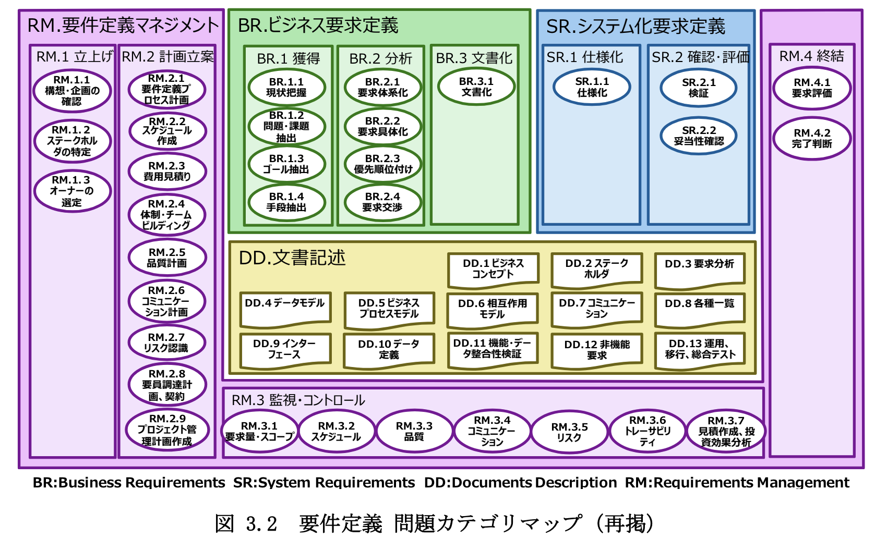

> ユーザのための要件定義ガイド 第2版 要件定義を成功に導く128の勘どころ 
P75 : 図 3.2 要件定義 問題カテゴリマップ

* **「BR.ビジネス要求定義」**
    * 企画工程で整理された経営レベルの利害関係者要求事項を業務の観点で獲得（BR.1 ビジネス要求の獲得）し、ビジネス要求の各項目間の関連の整理、優先度付け（BR.2 ビジネス要求の分析）、文書化(BR.3 ビジネス要求の文書化)を行う。
* **「SR.システム化要求定義」**
    * 「BR.ビジネス要求定義」で定義した要求を機能要件、非機能要件の観点で詳細化、文書化(SR.1 システム化要求の仕様化)し、検証や妥当性確認(SR.2 システム化要求の確認・評価)をして要件として定義。
* **「RM.要求マネジメント」**
    * 要件定義工程遂行プロジェクトの立上げ(RM.1 立上げ)と計画(RM.2 計画立案)、「BR.ビジネス要求定義」や「SR.システム化要求定義」の活動中における監視・コントロール(RM.3 監視・コントロール)と要件定義工程の実行結果の評価と完了判断を行う終結作業(RM.4 終結)に分類。
* **「DD 文書記述」**
    * 要件定義で作成する 36 の主要な成果物をここに集約し、各ドキュメントの記載項目とサンプルドキュメント、作成時の留意事項などを提示している。
    (自分が実際の開発作業で担当することになるのはここらへんの内容)

### 要件定義ドキュメント
「BR.ビジネス要求定義」、「SR.システム化要求定義」を定義したあと、後続する設計、実装、テスト工程につなぐ主要な要件定義ドキュメント。

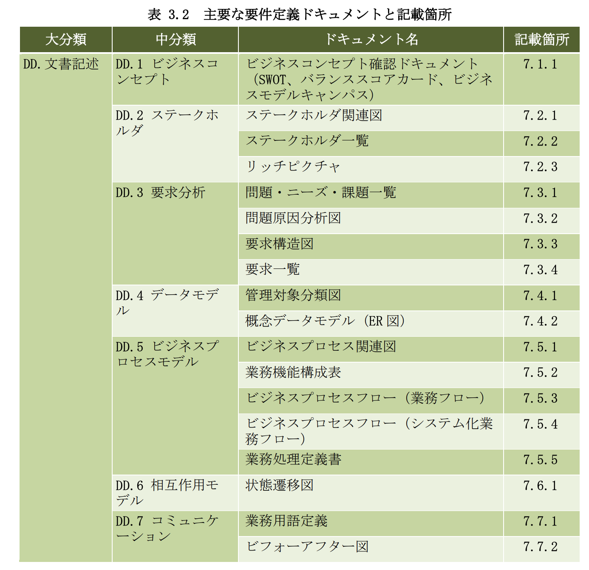

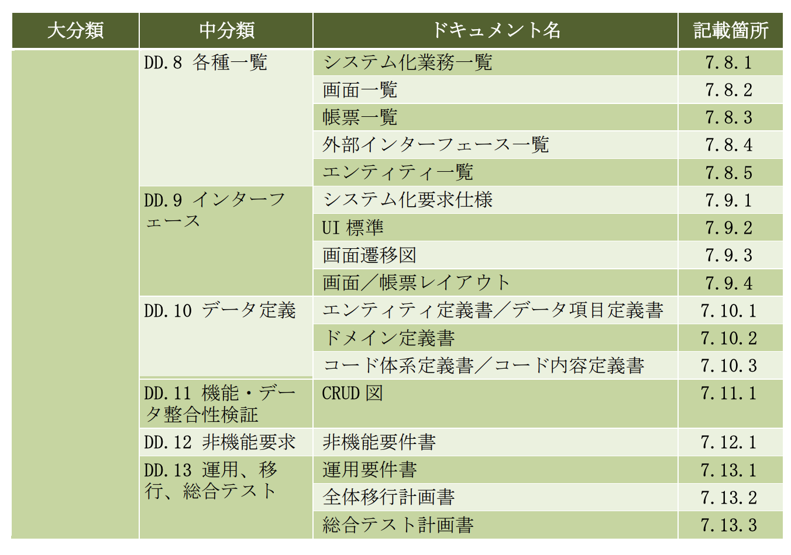

> ユーザのための要件定義ガイド 第2版 要件定義を成功に導く128の勘どころ 
P82 : 表 3.2 主要な要件定義ドキュメントと記載箇所

### 用語
要求、要件に関しての用語は **「JIS X 0166 システム及びソフトウェア技術-ライフサイクルプロセス」** で定義されている。
このガイドではこのJIS規格を元に、「要求の分類」「要求と要件の違い」を定義している。

#### 要求の分類

「利害関係者要求事項」「システム要求事項」「ソフトウェア要求事項」に分類される。

* 利害関係者要求事項
    * 利用者及び他の利害関係者によって必要とされるサービスを提供するためのシステムに対する要求事項。
* システム要求事項
    * システム及びその運用環境並びに外部インターフェース
に対する要求事項（機能・性能・設計制約・属性）の構造化された集合。
* ソフトウェア要求事項
    * ソフトウェア及びその外部インターフェースへの要求事項（機能・性能・設計制約・属性）の構造化された集合。

とあるが、定義だけではよくわからない。 
このガイドでは利害関係者要求事項「ビジネス要求」、システム要求仕様を「システム化要求定義」と定義し、例として、部品メーカの在庫管理を元に以下のような例が記載されていた。

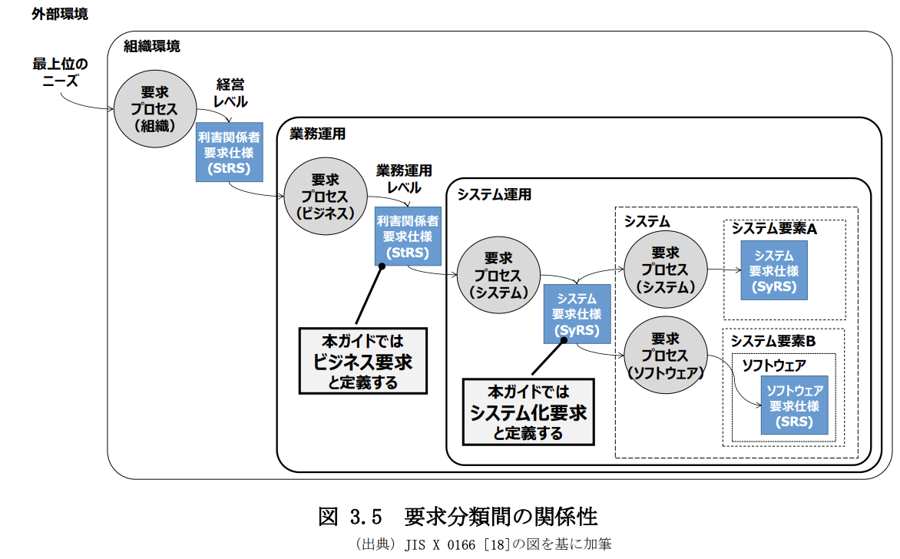
> ユーザのための要件定義ガイド 第2版 要件定義を成功に導く128の勘どころ 
P87 : 図 3.5 要求分類間の関係性 

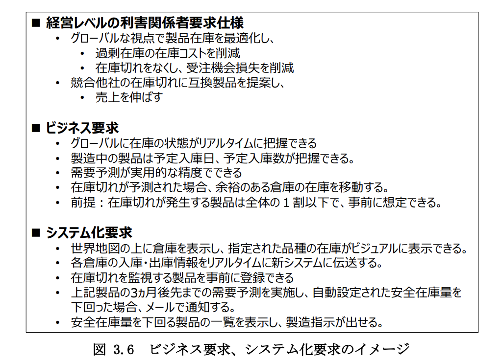
> ユーザのための要件定義ガイド 第2版 要件定義を成功に導く128の勘どころ 
P87 : 図 3.6 ビジネス要求、システム化要求のイメージ 

#### 要求と要件の違い
JIS X 0166には「要求」と「要件」の標準的な定義は存在しないらしい。 
このガイドでは「要求」は JIS X 0166 における要求事項と同義としている。 
では「要件」はというと **「要求を文書化、仕様化し、ステークホルダと合意したもの」** 

### 要件定義で大まかに意識すること

#### 1. 経営や業務に貢献する要求を見極める
* いざ要件定義を終えてみると当初の狙いが達成できていない要件定義になっていることがある。
* 経営層や業務部門のすべての要求を実現できるわけではない
* 経営層や業務部門との合意形成や積極的な経営層、業務部門の参画などが要件定義には求められる。

#### 2. 要求を実現する新しい業務を作り上げる
* 多くの場合、経営者のIT投資の意図は**ビジネスプロセスのチェンジ**である。
* 新しいビジネスプロセスを明確に定義し、業務運用までつなげるのも要件定義

#### 3. 要求仕様を「抜け」「漏れ」「あいまい」なくシステム開発につなげる
システム開発の失敗の原因の多くが要件定義にあり、その中でも要求仕様の決定や漏れが一番多く、開発工程で気づいて手戻りを起こしている。漏れなどの発覚が遅ければ遅いほどコストがかかる。

## 要件定義でベンダ企業が意識すること

* 【要件定義の契約基本形は準委任契約である】
    * 準委任契約を基本として、ユーザー主体で進める。要件定義を一括で請け負うと問題が発生する。
* 【ユーザ企業課題解決貢献】
    * お客様のビジネス課題をお客様と一緒に考え、ソリューション、ビジネス価値を提供する企業に変わっていく必要がある。
    * 要件定義に入り、IT技術活用を提案していくのが理想
* 【要求仕様の凍結】 
    * ベンダ企業にとって、要件定義のアウトプットである要求仕様は重要なインプットであるが、仕様の細部が決まらないだとか、仕様が変化し続けたりするといった仕様未凍結の問題がある。そうならないように要件定義の完了時点で凍結できるようにベンダ、ユーザーともに努力する必要がある。
* 【見積り】
    * 見積もりの誤りの原因  
        * 楽観的な見積もり: 見積り根拠があいまいで、必要な要素をきちんと見積もっていない。
        * 早期の見積り: 作るものが決まっていない状況で見積りを行う
        * 目標と見積りの混同: 営業、マーケティング担当者や顧客の事情で決定される。
        * 一度決まったら修正されない見積り
    * 見積もりは下の図の通り、工程が進めば精度が上がるため、都度再見積もりすべきである。

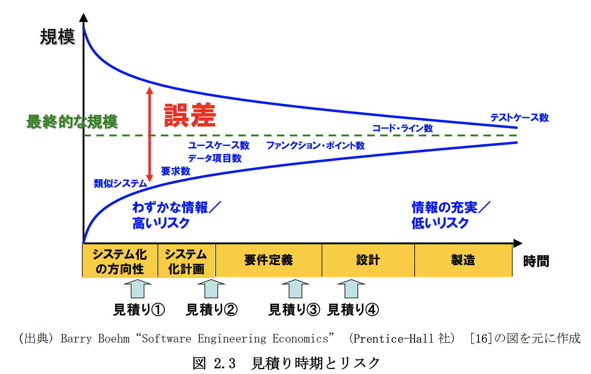
> ユーザのための要件定義ガイド 第2版 要件定義を成功に導く128の勘どころ 
P66 : 図 2.3 見積り時期とリスク

## ビジネス要求定義

「BR.ビジネス要求定義」では、大きく 3 つのサブプロセスに分けて作業を行う。
作業を行うのは

1. 現状業務、システムの把握をした上で、それらの問
題、ならびに解決すべき課題を抽出し、目指すべきゴールとその手段を抽出する
2. 目指すべきゴールを実現するために必要な要求の体系化や実現手段の検討し、要求の範囲と優先順位をステークホルダと合意する
3. 合意した範囲の要求について文章化

ビジネス要求定義は、各ステークホルダから問題、ニーズ、課題が混在して提示され、そこから解決すべき課題を見極め、施策（ビジネスプロセス改善要求やシステム化要求）を検討するというのが大きな流れ

#### BR 1.1 現状の把握
1. 現行システム等から可視化して現行業務、システムの理解を深めましょう。
2. 可視化したらその情報をプロジェクト全員に共有しましょう。

#### BR 1.2 問題・課題の抽出
1. ステークホルダを漏らさずに洗い出しましょう。(漏れてるとちゃんと要求が出せないよ)
2. ステークホルダが明確になったら、各ステークホルダの問題、課題の違いを認識しよう
3. ステークホルダ間の対立・関連を見極めよう。

##### 抽出の観点(例)
* 直接的な関わりを持つ関係者
    * 対象業務の運用者
    * 対象システムの運用者
    * 対象業務・システムの最終利用者（お客様やエンドユーザなど）
    * 業務の結果で評価される人（経営層など）
* 間接的な関わりを持つ関係者
* 対象業務と関連する顧客、取引業者
* 対象業務と関連する業務の運用者
* 対象業務と関連する業務の結果で評価される人（経営層など）
* 対象システムと関連する外部システムの運用者
* 対象業務の主管部門以外の組織の人
* 対象システムの外部システム

#### BR 2.2 要求の具体化
* 「〜したい」という要求を具現化、具体化するための新しい業務の姿を描くことを「要求の具体化」と表現する。

## システム化要求定義(SR)

大きく2つのプロセスに分けて作業する。

1. 「BR.ビジネス要求定義」で文書化した要求を機能面、非機能面の
両面で分析し、文書にまとめて仕様化
2. 作成した文書の記述内容が構造的、意味的に正しいかどうかをレビューを通じて検証。あとは要求を満たしているかどうかステークホルダと確認。

### 仕様化
システムに関与するステークホルダが導入するシステムや製品が技術、運用面で実現可能か、運用面で問題ないかを確認できる文書を作る。

1. ドキュメントの全体像、関連を明確にする。
    * 「SR.システム化要求定義」で作成する主要ドキュメントとその関係を解説することで、ドキュメント間の不整合をなくし、標準化を徹底する。
2. 正確な日本語表現を使って、文章のあいまいさを排除し要求を正しく伝達する
    * 後続の設計品質下がる
    * ユーザーテストで要求レベルの指摘が多発する
    * 要求の実装漏れ、仕様誤りが本稼働後に発生する。

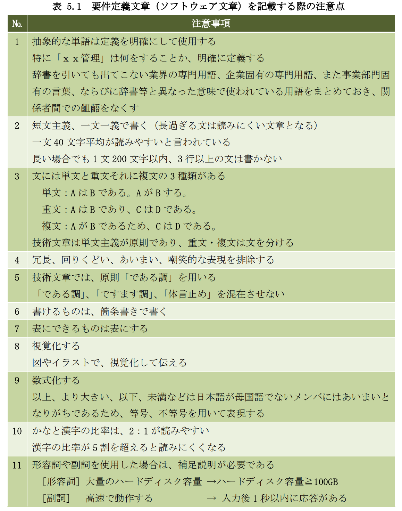
> ユーザのための要件定義ガイド 第2版 要件定義を成功に導く128の勘どころ 
P159 : 表 5.1 要件定義文章（ソフトウェア文章）を記載する際の注意点

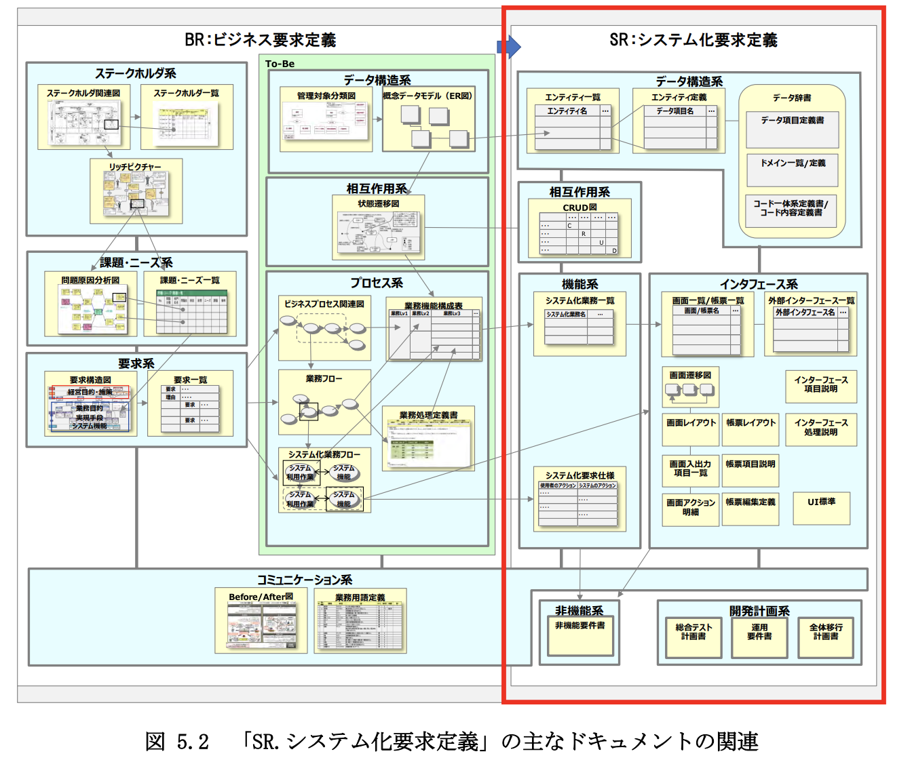
> ユーザのための要件定義ガイド 第2版 要件定義を成功に導く128の勘どころ 
P160 : 図 5.2 「SR.システム化要求定義」の主なドキュメントの関連

### 検証
* 組織的なレビューをする。
    * レビュー観点の整理、レビュー実施体制、やり方を定義した上でレビューをすることで、抜け漏れを少しでも防止する。(完全には難しい)

### 妥当性確認

* システム部門、ベンダーが作ったドキュメントを業務部門が分かるように成果物の作成およびレビューを工夫する。
    * ビジネス要求がどのようにシステム化要求に反映されているかが、相手に正確に伝わるようにレビュー対象物を作成する

## ドキュメント
**※以前読んだ「モデルベース要件定義テクニック」にないもので参考になりそうなもの抜粋**

### ステークホルダ一覧
ステークホルダの漏れがない状態にするための一覧 
適宜、見直しをする。

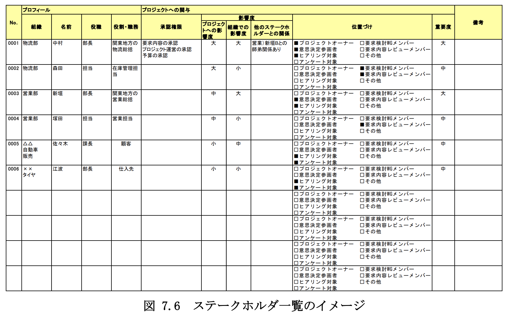
> ユーザのための要件定義ガイド 第2版 要件定義を成功に導く128の勘どころ 
P360 : 図 7.6 ステークホルダ一覧のイメージ

### リッチピクチャ
* ステークホルダの位置付けや心情などからステークホルダの依存関係や課題などを
明確にし、ステークホルダとの対話を効率的に実施していく状態にする。
* ステークホルダの主観的な思いや意見を絵と文字によって表す。

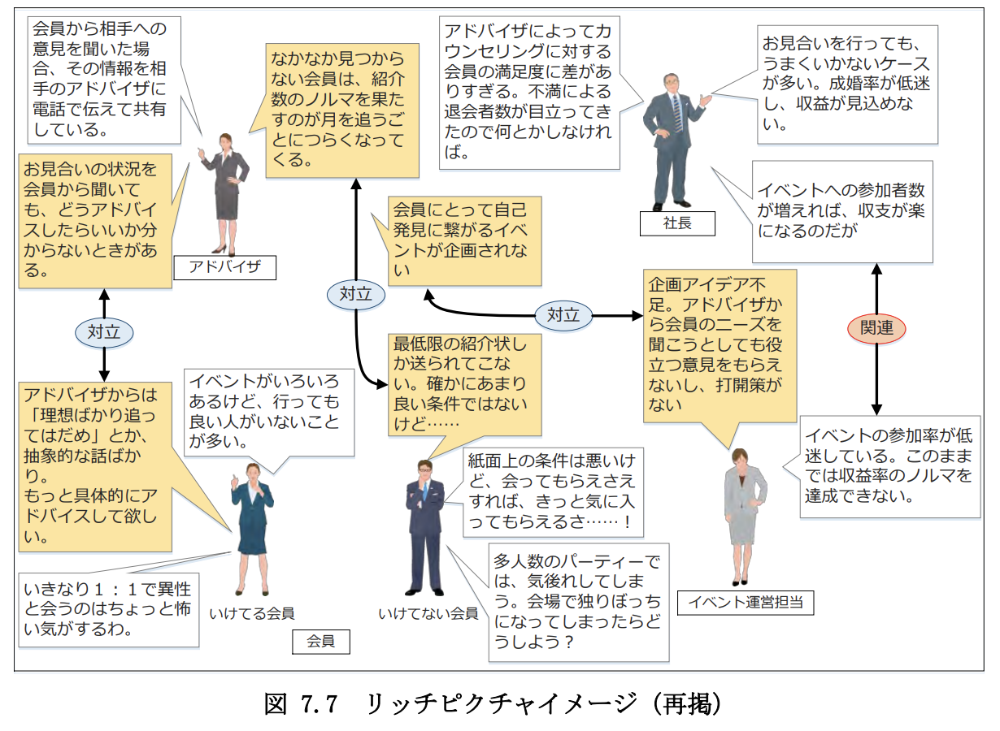
> ユーザのための要件定義ガイド 第2版 要件定義を成功に導く128の勘どころ 
P362 : 図 7.7 リッチピクチャイメージ

### 業務用語定義
業務用語を一覧化したもの

* 業務用語を定義してプロジェクトメンバがその意味を理解する
* 業務部門やシステム開発に携わる人など関係するステークホルダに対し、共通認識をはかることにより、コミュニケーションの齟齬を低減させる

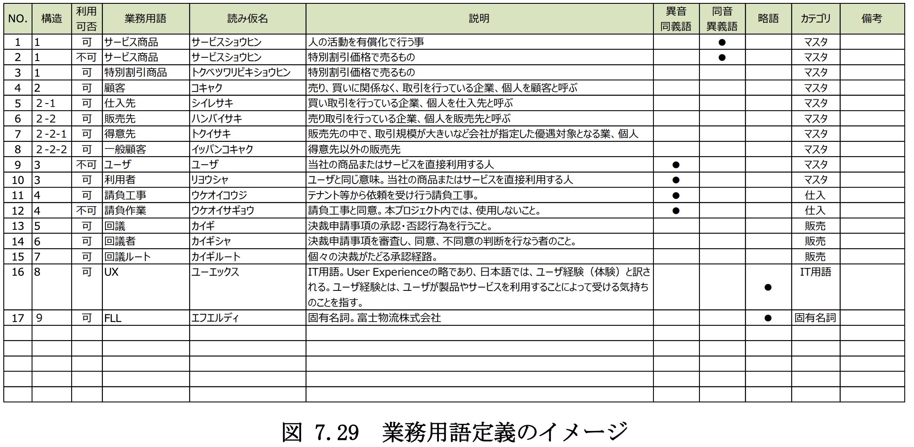

> ユーザのための要件定義ガイド 第2版 要件定義を成功に導く128の勘どころ 
P362 : 図 7.29 業務用語定義のイメージ

### CRUD図
エンティティのインスタンスの作成、参照、更新、削除をエンティティとシステム化業務とのマトリックスで表現したもの。

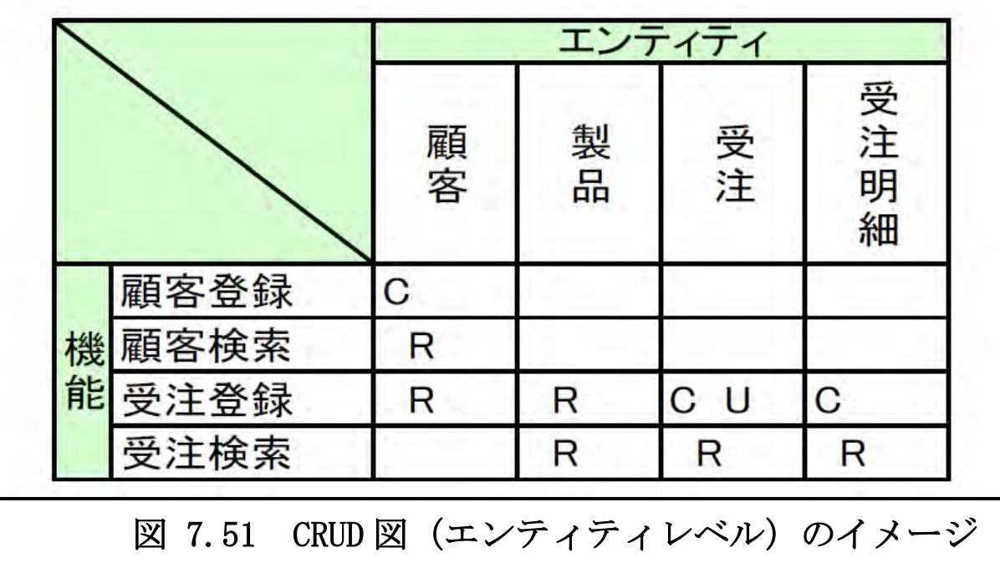

> ユーザのための要件定義ガイド 第2版 要件定義を成功に導く128の勘どころ 
P362 : 図 7.51 CRUD図