# モデルベース要件テクニック_メモ

## 要件定義


* 要件定義とは
    * 「どのようなシステムを構築するか」という部分で、**システムの最終成果物のイメージを伝えるもの**<BR>
    システムの個々の機能や条件を列挙することが本質ではない。
* 適切な要件定義
    * **定義された要件がもれなく、重複なく、各々の要件が整合しており、それがわかりやすく表現されているもの**が適切な要件定義と言える。
### 手法
リレーションシップ駆動要件分析(RDRA)を使用する。


## 要件定義の構造
要件定義は、システムを取り巻く環境を明らかにし、その中でビジネス的な価値を提供するために必要なシステムの機能とデータを定義すること。

システムを取り巻く環境とは以下を指す。

* システムは関係者や外部システムとの接点を持つ
* 関係者には直接システムに関わるユーザーや組織、ならびにシステムに影響を与える利害関係者がいる
* システムは業務や作業（ツールなどの利用）の一環として使われる
* その業務や作業は結果として「もの」「情報」「サービス」などのビジネス価値を提供する

**要件定義はこれらを説明して、最終的にシステムの機能とデータを定義したものになる。**

RDRAでは要件定義の構造を4つの領域に分けており、上から順に各ステップをこなしていく。

* 価値を生み出す対象 -> **システム価値**
* システムを取り巻く環境 -> **システム外部環境**
* システムとの接点 -> **システム境界**
* システムそのもの -> **システム**

## 要件を捉える4つのステップ
### ステップ1 システム価値を明確化する
洗い出すもの
* システムに関わる人
* システムに関わる外部システム
* 「システムに関わる人」から出た要望・要求
    * **要望: 個人レベルのもの**
    * **要求: 組織内で共有されているもの**

ここで明らかにされた要件が、その後の「システム外部環境」「システム境界」「システム」に方針を与えることになる。

最終的にシステム価値では「目的」「役割」として数行の簡潔な文でまとめる。

```
「このシステムの目的・役割は○○を実現することです」
そのために「このシステムに関わるのは○○、○○のような人や組織で、関係する外部システムは○○、○○などがあります」、
そして「この関係者は○○、○○のような問題や課題を抱えており、その改善として○○、○○などの要求を持っています。
それらを満たすために今回のシステムは○○、○○の要件を実現する必要があります」
```

### ステップ2 システムの外部環境を把握する

システムはビジネス環境の中で価値を生み出すために、環境に大きく依存し、同じようなシステムでもその環境が違うと要件も変わる。

システムを取り巻く環境を決めることはシステムの要件を決める上で決定的な役割を果たす。


システムの外部環境を決めるには2つのやり方が存在する。

1. 業務の一連の流れを支援する、業務フローとしてのシステム外部環境
2. 個々の作業を支援する、ツールやユーティリティなどのシステムを利用するシーン

### 業務の一連の作業を支援するシステムの場合
**作った業務フロー内の一連の作業がビジネス的な価値に結びついていることが重要**

このステップではビジネス視点で外部環境を捉えることが大切なので、システムを意識して要件定義をまとめない(システム化に都合に良い業務フローや作業を抽出してしまうので)

### 作業を支援するシステムの場合

ツールやユーティリティなど業務に直接環境がない、ある特定の作業を支援するシステムの場合はそのシステムを利用するシーンを洗い出し、利用するシーンに価値があれば、「システム価値」を出すことができる。

例
```
スケジューラのようなソフトの場合、必要なリソースを取り込み、様々な制約の中で最適なスケジュールを作成すること。そのスケジュールを組む場面や、必要な情報を取り込む場面など、そのシステムならではのシーンを考える。
```

### 外部環境を捉えるためのポイント
* ユーザーを特定できない場合。
    * パッケージソフトなどは特定のユーザーがいない。なので、要件定義メンバー間の合意のために、外部環境を明らかにする。<br>
    そのシステムの利用者にとって楽しいこと、役に立つことを創造する
* システムの外部環境が自明な場合。
    * 老朽化のためシステムの再構築をする場合がある。業務や作業が変わらないなら、既存の業務フローがあればそれを代用する。
* 概念を明らかにする。
    * 仕事に必要な用語や作業の手順などは全て何かしらの概念の上に成り立っている。商品を販売する仕事の場合、商品という用語を取り巻く様々な決まり事や慣習があるので、それを明らかにする。


最終的にシステム外部環境として伝えることの例。

```
「システムを活用する業務には○○、○○があり、これらの業務はこのようなビジネス価値があります。
その価値は今回開発するシステムを使って実現されます」
そして「この業務では○○、○○などの概念があり、その構造は次の○○、○○で構成され、各々○○、○○の関係があります」
もしくは
「このシステムは利用シーンとしてこれらの○○、○○で活用され、各々次のようにシステムを利用します。
このシーンでは○○、このシーンでは○○、○○などです。
今回開発するシステムは先にあげた利用シーンを満足する機能を持つ必要があります」
```

### ステップ3 システム境界を把握する
システムに関わるユーザーや外部システムとの接点がシステム境界になる。

システム境界で明らかにすることは以下の3つ。

1. システムとの接点としての入出力情報
2. その情報の入出力タイミング
3. 入出力情報とタイミングのルール化

**システム境界はユーザーがシステムを認識できる唯一の場所**。
システム境界はユーザーインターフェースとシステムインターフェスに分かれ、ユーザーインターフェースはユーザーとの接点を示し、画面・帳票・ユースケースで表す。システムインターフェスは外部システムとの接点となり、イベントとして表す。

最終的にシステム境界として伝えることの例

```
「今回のシステムは○○、○○.などのユースケースがあり、その中で○○、○○.画面、帳票が使われます。
以下に続く各ユースケースではシステムの接点としてシステムとの関わり方を示します。
この○○ユースケースでは…また、外部のシステムとして○○、○○システムと関係を持ちます。そして各システムとは○○、○○.イベントでやり取りされます。
外部システムとのやり取りは状態を把握することでルール化します。
この外部システムは○○、○○.のような状態をとり、その状態は○○、○○.のイベントで遷移します」
```

### ステップ4 システムを把握する
機能とデータを定義する。

#### 機能を洗い出す
機能は以下の2種類に分かれる。

* **システム境界で洗い出されたユースケースから利用される**
* **外部システムからのイベントに対応する**

この機能がシステムが行うことを表す。

#### データを洗い出す
機能が扱うデータも洗い出す必要がある。

データの候補はシステム境界で必要とするデータ。
(具体的には画面や帳票で使われる情報や外部システムとやり取りする情報)

最終的に「システム」として伝えることの例


```
「このシステムには○○、○○の機能があります。データとして○○、○○があります。
ソフトウェアは○○のようなドメイン構造をしており、このようなことができます。
機能とデータの関係はCRUDで○○のように整理しており、
各々のデータのライフサイクルは○○、○○のようになっています」
```

### 要件定義に網羅性をもたせる
システム全体に網羅性を持たせるためには、**「システム」から「システム価値」の4ステップで、中から外側に向かって網羅性を確保することが必要**

システムの機能とデータに網羅性を持たせるには、その前提であるシステム境界を明確にする必要がある。

そのシステム境界に網羅性をもたせるためにはその前提となる外部環境を明らかにする必要がある。そのために業務の流れと個々の作業を明らかにする。
... というように、システムに関わる人、組織からシステムに至るまでを順次網羅的に整理することで、漏れなく要件を定義できる。

**以下、網羅的に要件を出すための基本的な考え**
1. システムに関わる全ての関係者と全ての外部システムを洗い出す。
2. 関係者の要望、要求を捉え、同時にシステムの目的・役割を導き出す。
3. 上記関係者が関係する業務フローもしくは利用シーンを全て洗い出す。
4. 上記業務フローあるいは利用シーンに関わるシステムの接点（ユースケース、イベント）を洗い出す
5. 全てのユースケース、イベントに結びつく機能を洗い出す。

## 要件定義の表現方法

要件を個々のモデルとして定義する。
目的は開発メンバーの思考を視覚化し、共有することにある。

表現手段としては**UML**を拡張した表記法を利用する。

**定義したモデルはそのまま要件定義書として使用する。**

### なぜUMLで表現するか
要件として定義する対象はたくさんあり、システムの価値や、外部環境などシステム以外のものを表現することが求められる。<br>
UMLはこのような多様な視点で整理する手段としては有効である。


### 基本ダイアグラム
RDRAでは先程の4つのステップ毎に作成するダイアグラムが決まっている。それを**基本ダイアグラム**という。

もう一つ、**関係ダイアグラム**というものがあり、基本ダイアグラムの各情報をつなげて関係性を確認するものをがある。


### 各ダイアグラムの目的

| ステップ | 目的 |対応モデル | 
| ---- | ---- | ---- |
| 「システムの価値」を捉える | システムの目的・役割・責務を定義する |コンテキストモデル |
| ''| 対象業務に関わる人を洗い出す|コンテキストモデル |
| '' | 対象業務に関わる外部システムを洗い出す |コンテキストモデル |
| '' | 機能要求を捉える |機能要求モデル |
| '' | 非機能要求を捉える |非機能要求モデル |
| 「システム外部環境」を組み立てる| 対象業務の作業とその流れを捉える |業務モデル |
| ''| 対象業務に関わる概念を明らかにする |概念モデル |
| ''| システムの利用シーンを明らかにする |利用シーンモデル |
| 「システム境界」を捉える| システムの接点をユースケースとして捉える |ユースケースモデル |
| ''| システムの設定での入出力情報を捉える |画面・帳票モデル |
| ''| 外部システムとのやり取りとその情報を明らかにする |イベントモデル |
| ''| 上記のやり取りをルール化する |プロトコルモデル |
| 「システム」を定義する| 機能を明らかにする |機能モデル |
| ''| データを明らかにする |データモデル |
| ''| ドメインの構造を把握する |ドメインモデル |


### コンテキストモデル
* システムに関係する人と外部システム、システムの目的・役割を明らかにする。
* 以降の各モデルではここで洗い出したアクターを使う
* システムの目的・役割を表し、このシステムはなんのためにあるのかを一言で説明できるようにする。

作成例

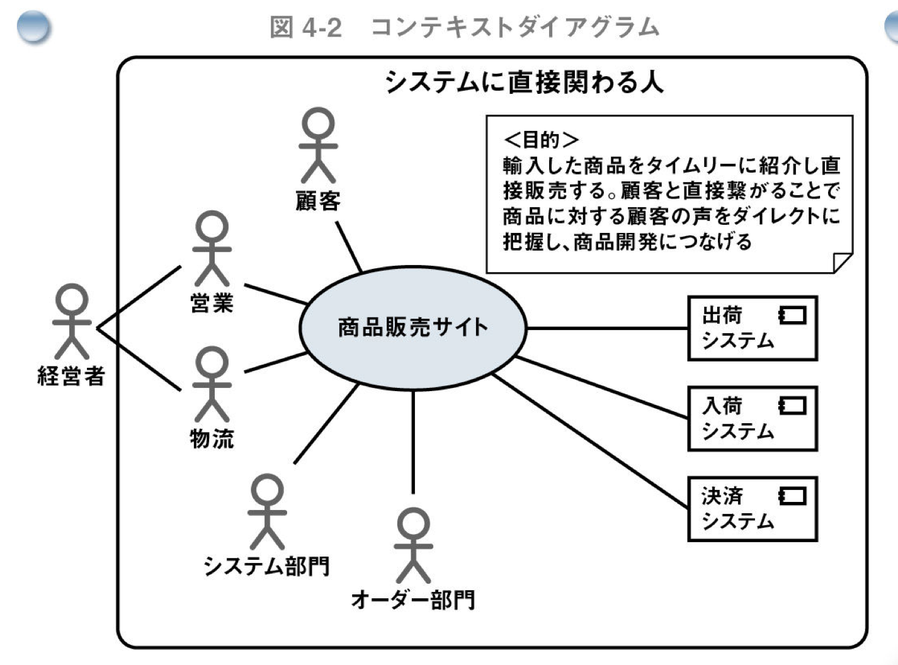

> 神崎善司 著「モデルベース要件定義テクニック」 コンテキストモデルの作成例 図4-2


### 要求モデル
* システムに対する要望、要求をヒアリングし、そこから本質的な要求を明らかにする。
* コンテキストモデルのアクターに該当する、実際の人から要望・要求を集める。
* 「要望」はヒアリングしたことをそのまま記録し、実際の要件分析に活用できるように「要望」から「要求」へ構造化。

作成例

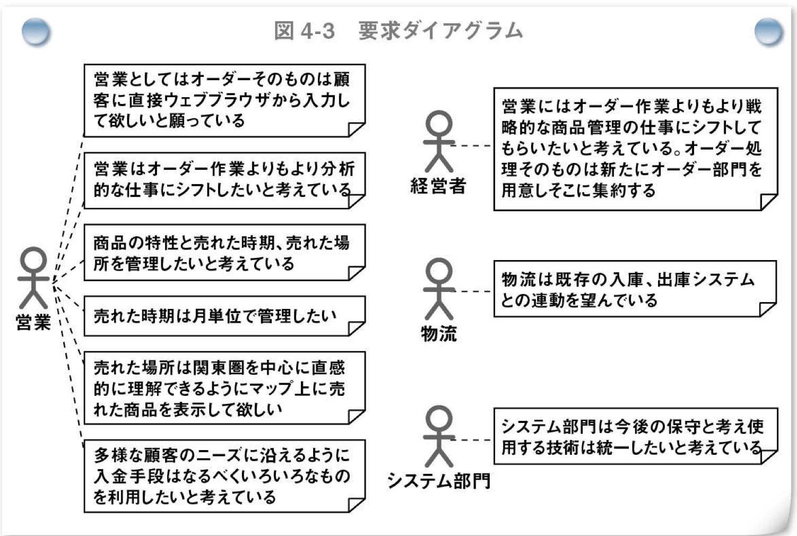

> 神崎善司 著「モデルベース要件定義テクニック」 要求モデルの作成例 図4-3


### 業務モデル
* 一連の作業の流れを表したモデル。業務に関わる人や組織が担う作業を整理する。(コンテキストモデルに出てきたアクターを使う。)
* 一連の流れを設計することで、ビジネス視点で業務の流れを設計し、ビジネス価値が明確になるまで洗練化する。

作成例

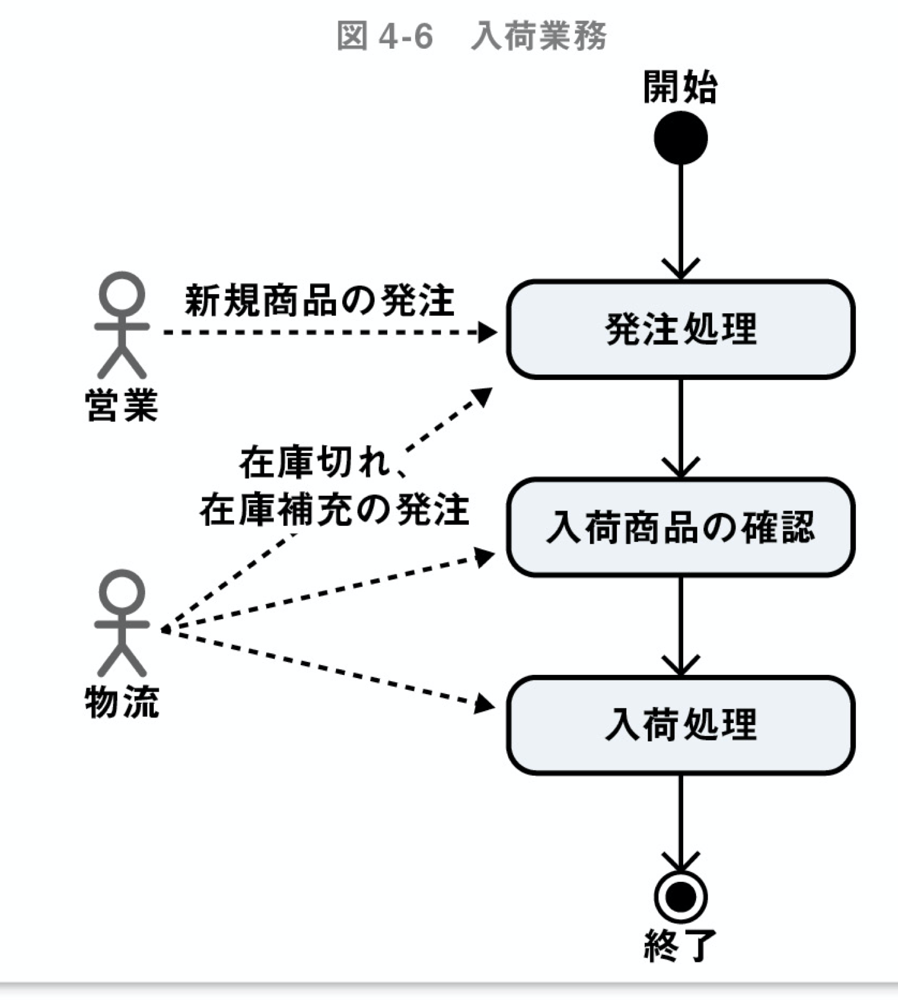

> 神崎善司 著「モデルベース要件定義テクニック」 業務モデルの作成例 図4-6


### 利用シーンモデル
ツールやユーティリティなど、特定の作業を支援するシステムの場合は、システムが利用する場面を描くことが有効。これを利用シーンモデルという。

* システムが利用されている状況を具体的にイメージできる文章や絵を使って表現する。
* あくまでも有効なシステムにするための要件を洗い出す手段。(ビジネス的な価値を実現していることが重要)

作成例(※RDRAのモデルチェックシステムの開発)


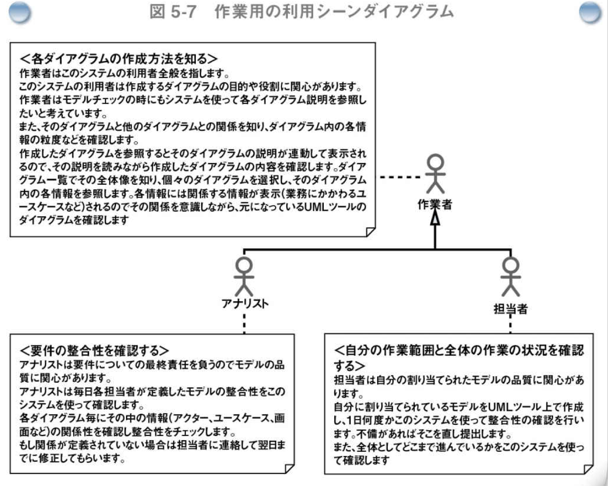

> 神崎善司 著「モデルベース要件定義テクニック」 利用シーンモデルの作成例 図5-7


### 概念モデル
業務の中で認識されている概念を表す用語の意味と、それらの関係をクラス図を使ってモデル化したもの

* 認識されている概念について合意のない中で話をすると話が噛み合わないときがあるので、はっきりさせる。
* システムで扱うルールの明確化にも役立つ。


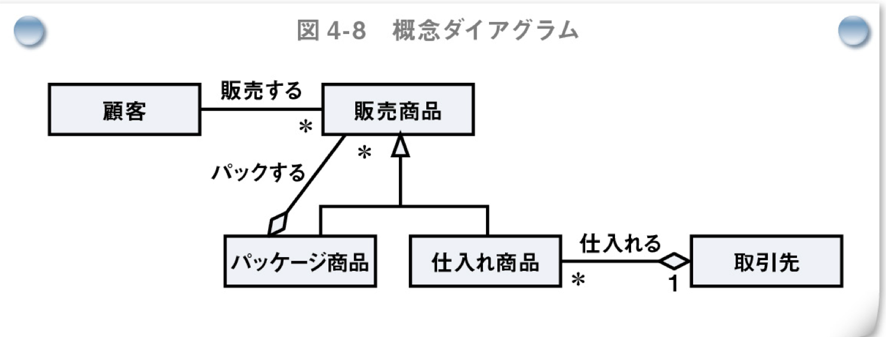

> 神崎善司 著「モデルベース要件定義テクニック」 概念モデルの作成例 図4-8


### ユースケースモデル
人がシステムと関わる部分をユースケースとして洗い出す。
システムの外部環境である業務モデル、利用シーンモデルに関わるユースケースを全て洗い出すことで、システム境界を明確にしたことになる。

* ユーザーから見たシステムの全体像になる
* 人が関わるシステム境界を示すことが目的で、ユースケースの詳細化を行うことはしない。


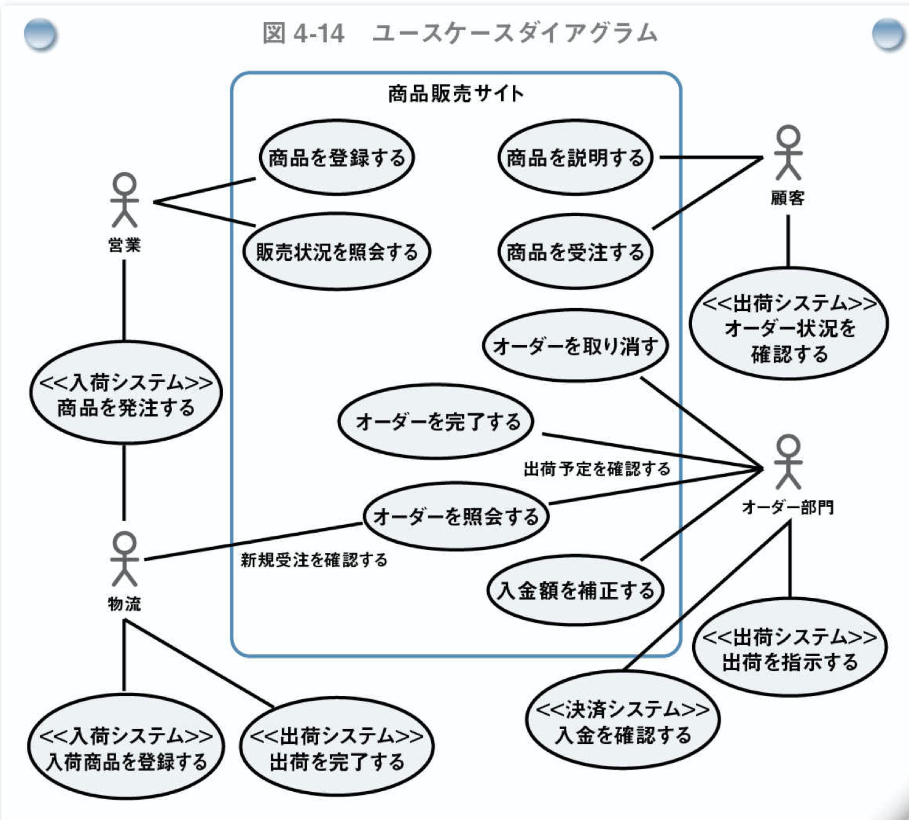

> 神崎善司 著「モデルベース要件定義テクニック」 ユースケースモデルの作成例 図4-14


### 画面・帳票モデル

* ユーザーインターフェースが扱う情報に関心のあるモデル。
* 入出力される単位とその項目を明らかにする。


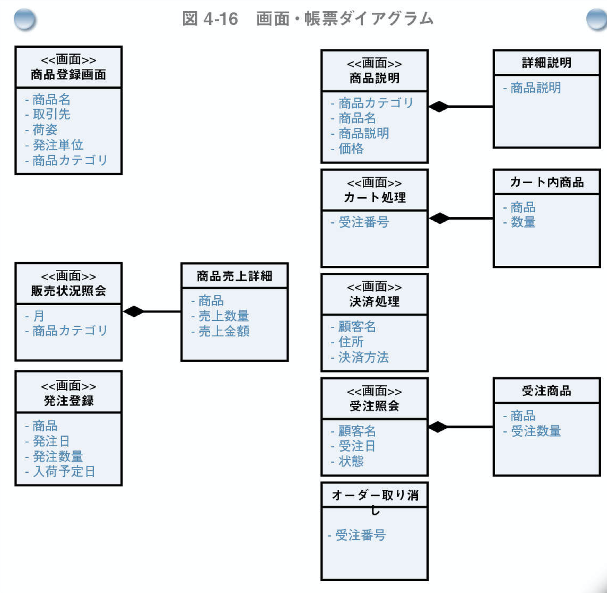

> 神崎善司 著「モデルベース要件定義テクニック」 画面・帳票の作成例 図4-16

### イベントモデル
外部システムとのやり取りを把握するために作成する。

* 外部システムと連携するデータタイミングを洗い出す。
* データはクラスアイコンを使い、タイミングはイベントとしてシグナルアイコンを使う。


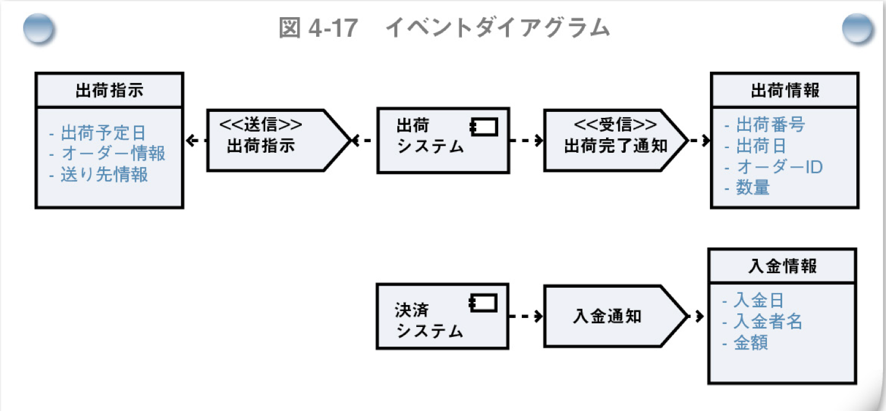

> 神崎善司 著「モデルベース要件定義テクニック」 イベントダイアグラム作成例 図4-17


### プロトコルモデル
入出力(画面・帳票モデル、イベントモデル)との連携をルール化する役目

システムに対する入出力の順番と条件を状態を使ってルール化する。


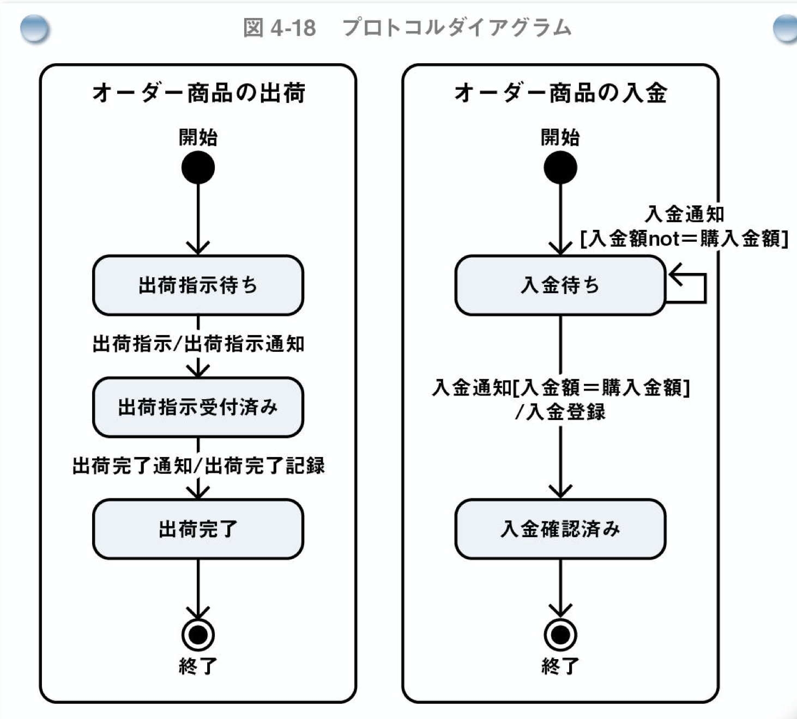

> 神崎善司 著「モデルベース要件定義テクニック」 プロトコルモデル作成例 図4-18


### 機能モデル

ユースケースやイベントを実現する「機能」を洗い出すのが機能モデル。

ユースケースとは別に機能モデルを作成する理由は、システムとしての必要な機能を適切な名前で表現するため。


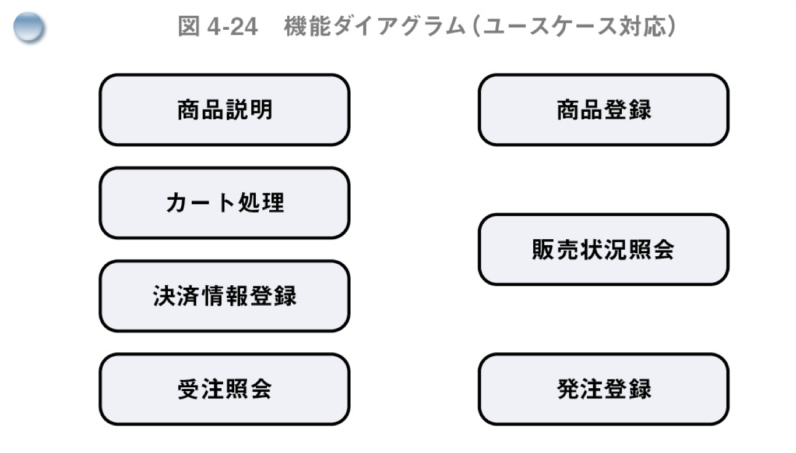

> 神崎善司 著「モデルベース要件定義テクニック」 機能作成例 図4-24


### データモデル

システムの中で扱う情報をデータモデルとして表現する。
最終的にデータモデルは永続化対象になることが多い。


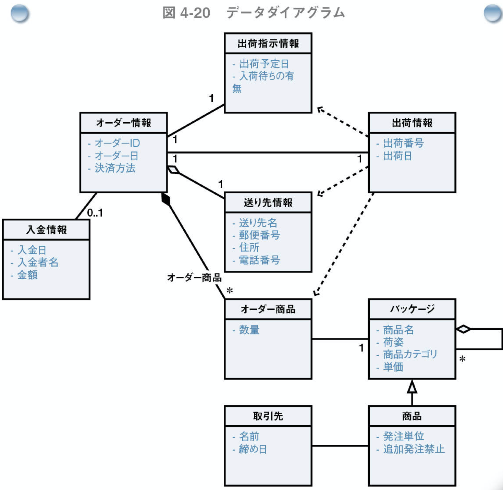

> 神崎善司 著「モデルベース要件定義テクニック」 データダイアグラム作成例 図4-20


## 各ダイアグラムの関係

各モデルの中で表現された情報は各々関係がある。
「システム価値」に含まれるモデルから「システム」に含まれるモデルまで全て繋がる。

### システム価値からの関係
* 各モデルのアクターはコンテキストモデルのアクターを使う
* 要求アイコンは他の全てのアイコンと結びつけることができる

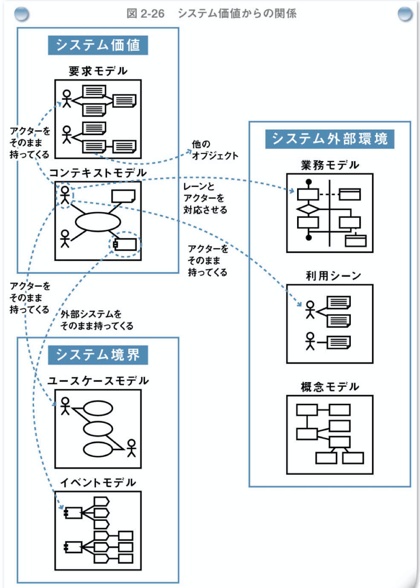

> 神崎善司 著「モデルベース要件定義テクニック」 図2-26


### システム外部環境とシステム境界との関係
* 業務フローの各アクティビティの中でシステムと関係を持つものについては業務フロー&ユースケースダイアグラムを使い、アクティビティとユースケースを結びつける。
* 利用シーン&ユースケースダイアグラムを使い、画面・帳票とユースケースとの関係をユースケース&画面帳票ダイアグラムで表す。

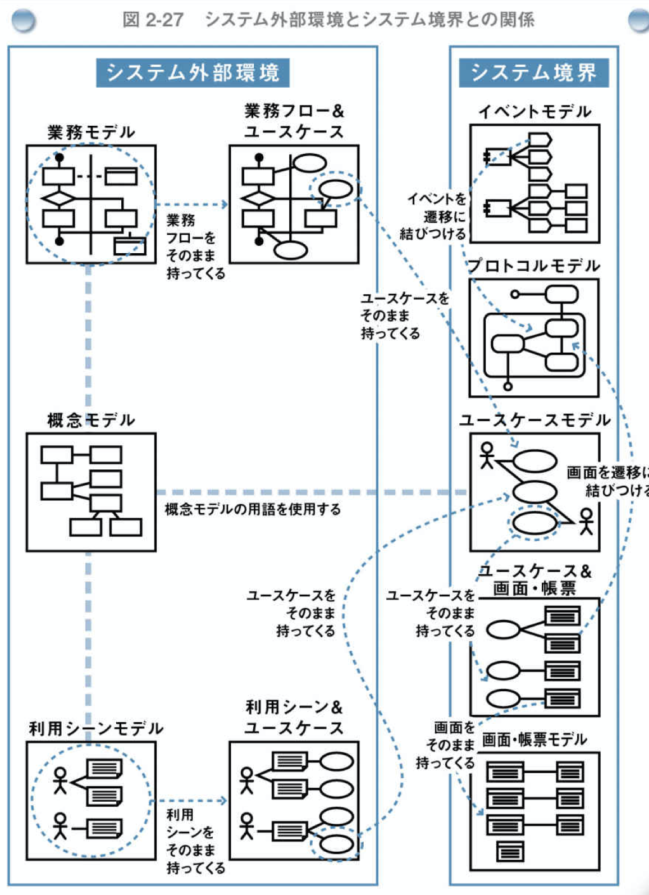

> 神崎善司 著「モデルベース要件定義テクニック」 図2-27

### システム境界とシステムとの関係
「システム」内の各モデルと「システム境界」のモデルを結びつけるために、機能複合モデルを作成する。

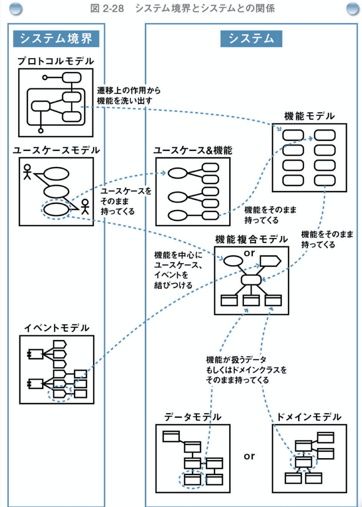

> 神崎善司 著「モデルベース要件定義テクニック」 図2-28
